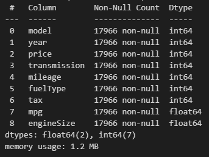
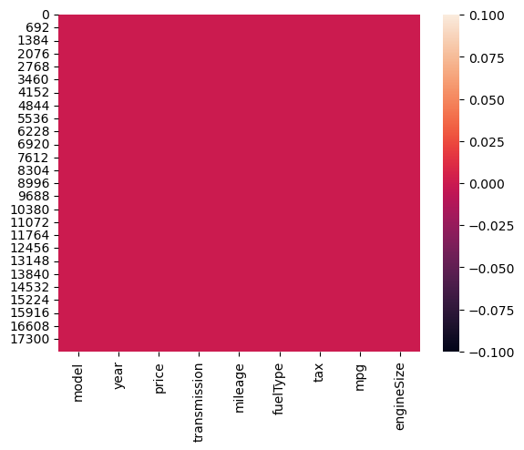
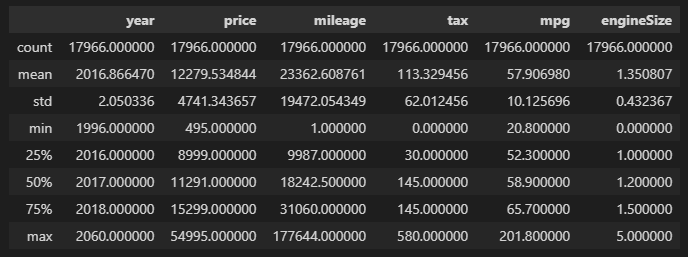
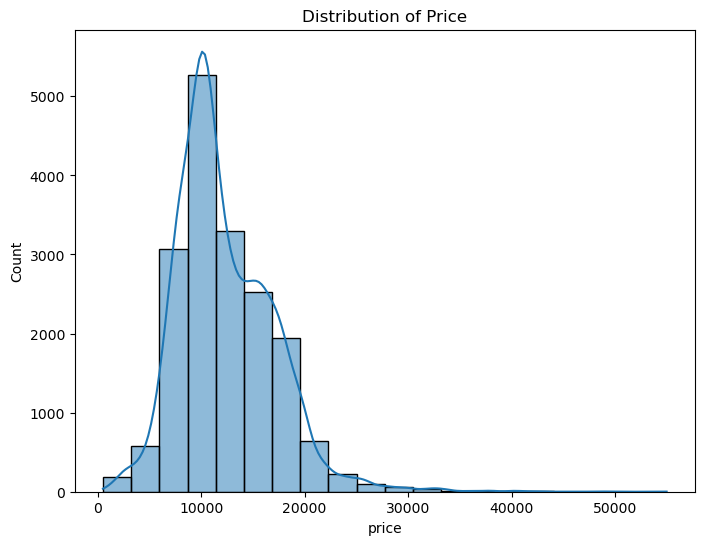
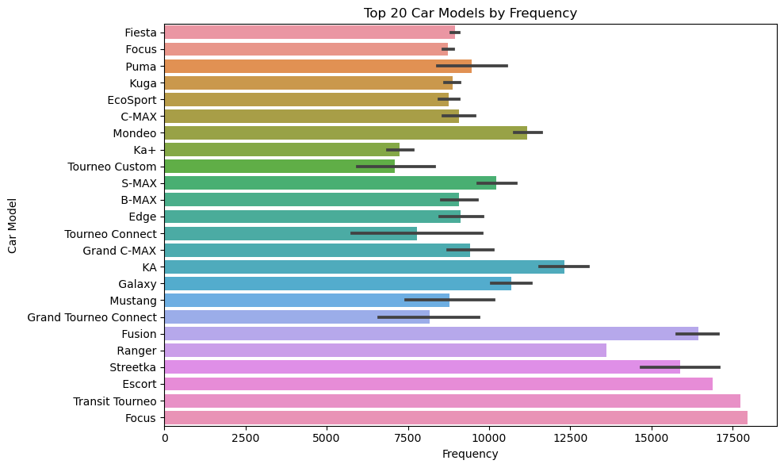
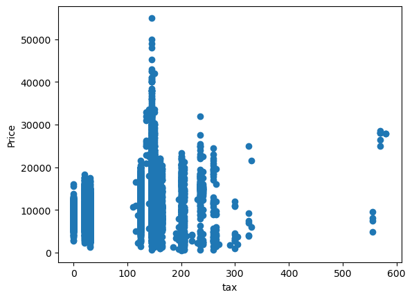
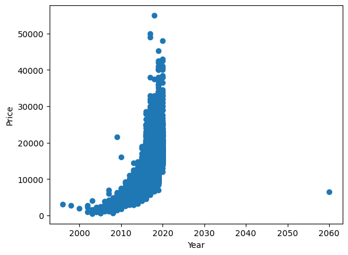
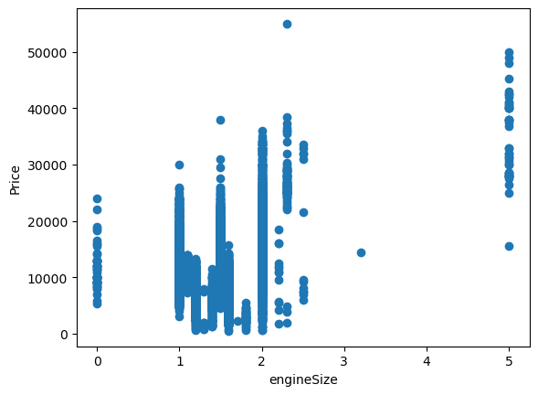

# Laporan Proyek Machine Learning
### Nama : Ilham Septa Nugraha
### Nim : 211351064
### Kelas : IF Pagi B

## Domain Proyek

Proyek ini berkaitan dengan prediksi harga mobil Ford dari yang lama sampai yang terbaru. Latar belakang proyek ini adalah untuk membantu masyarakat yang akan membeli mobil dari brand Ford mengetahui patokan harga yang pas.

## Business Understanding

Dalam bagian ini dapat memberikan wawasan kepada orang yang hendak membeli mobil dari brand Ford agar tahu faktor apa saja yang menyebabkan harga mobil ini ada di harga tertentu.

### Problem Statements

Latar belakang masalah :
- Pembeli kesulitan memperkirakan harga mobil dari brand Ford.
- Pembeli bingung harus membeli mobil bekas dengan keadaan mobil seperti apa.

### Goals

Tujuan dari pernyataan masalah:
- Agar pembeli tau harga pasaran baru dari mobil brand Ford.
- Pembeli jadi tau jika mobil memiliki kekurangan berarti berada di harga yang ada di prediksi.

## Data Understanding
Dataset diambil dari kaggle.<br> 

[Ford Car Price Prediction](https://www.kaggle.com/code/amirhosseinyousefi/ford-price-prediction)

Mengimpor library yang dibutuhkan:

``` python
import pandas as pd
import numpy as np
import matplotlib.pyplot as plt
import seaborn as sns
```
Membaca Data pada CSV
```python
df = pd.read_csv("ford.csv")
```
Melihat isi data
```python
df.head()
```
<br>
Melihat tipe data apa saja yang digunakan dalam data pada setiap kolom
```python
df.info()
```

Melihat apakah dalam data ada nilai null atau tidak
```python
sns.heatmap(df.isnull())
```

Mengetahui deskripsi data
```python
df.describe()
```

```python
plt.figure(figsize=(10,8))
sns.heatmap(df.corr(),annot=True)
```
.png)
```python
plt.figure(figsize=(8, 6))
sns.histplot(data=df['price'], bins=20, kde=True)
plt.title('Distribution of Price')
plt.show()
```

```python
n = 20  # Number of top car models to plot
top_car_models = df['model'].value_counts().head(n)

plt.figure(figsize=(10, 6))
sns.barplot(x=df['model'].index, y=df['model'])
plt.title(f'Top {n} Car Models by Frequency')
plt.xlabel('Frequency')
plt.ylabel('Car Model')
plt.tight_layout()
plt.show()
```

```python
plt.scatter(df['tax'], df['price'])
plt.xlabel("tax")
plt.ylabel("Price")
plt.show()
```

```python
plt.scatter(df['year'], df['price'])
plt.xlabel("Year")
plt.ylabel("Price")
plt.show()
```

```python
plt.scatter(df.engineSize, df.price)
plt.xlabel("engineSize")
plt.ylabel("Price")
plt.show()
```

### Variabel-variabel pada Ford Car Price Prediction Dataset adalah sebagai berikut:
- model - > Ford Car Brands
- year - >Production Year
- price - >Price of car in $
- transmission - > Automatic, Manual, Semi-Auto
- mileage -> Number of miles traveled
- fuelType -> Petrol,Diesel,Hybrid,Electric,Other
- tax -> Annual Tax
- mpg - > Miles per Gallon
- engineSize - > Car's Engine Size

## Data Preparation
Dalam dataset ini untuk menyiapkan data untuk dijadikan model, di perlukan konversi data kategorikal ke numerikal. langkah-langkah yang perlu dilakukan adalah :
- Memilih atribut data yang dibutuhkan untuk prediksi harganya.
- Mengkonversi isi kolom data string ke tipe integer.

## Mengubah data tipe object menjadi integer
```python
model1 = st.selectbox('Input Model Mobil',[' Fiesta', ' Focus', ' Puma', ' Kuga', ' EcoSport', ' C-MAX',' Mondeo', ' Ka+', ' Tourneo Custom', ' S-MAX', ' B-MAX', ' Edge',' Tourneo Connect', ' Grand C-MAX', ' KA', ' Galaxy', ' Mustang',' Grand Tourneo Connect', ' Fusion', ' Ranger', ' Streetka',' Escort', ' Transit Tourneo', 'Focus'])
if model1 == ' Fiesta':
    model1 = 1
elif model1 == ' Focus':
    model1 = 2
elif model1 == ' Puma':
    model1 = 3
elif model1 == ' Kuga':
    model1 = 4
elif model1 == ' EcoSport':
    model1 = 5
elif model1 == ' C-MAX':
    model1 = 6
elif model1 == ' Mondeo':
    model1 = 7
elif model1 == ' Ka+':
    model1 = 8
elif model1 == ' Tourneo Custom':
    model1 = 9
elif model1 == ' S-MAX':
    model1 = 10
elif model1 == ' B-MAX':
    model1 = 11
elif model1 == ' Edge':
    model1 = 12
elif model1 == ' Tourneo Connect':
    model1 = 13
elif model1 == ' Grand C-MAX':
    model1 = 14
elif model1 == ' KA':
    model1 = 15
elif model1 == ' Galaxy':
    model1 = 16
elif model1 == ' Mustang':
    model1 = 17
elif model1 == ' Grand Tourneo Connect':
    model1 = 18
elif model1 == ' Fusion':
    model1 = 19
elif model1 == ' Ranger':
    model1 = 20
elif model1 == ' Streetka':
    model1 = 21
elif model1 == ' Escort':
    model1 = 22
elif model1 == ' Transit Tourneo':
    model1 = 23
elif model1 == 'Focus':
    model1 = 24
    
    year = st.selectbox('Input Tahun Mobil',[2017, 2018, 2019, 2015, 2014, 2016, 2013, 2020, 2012, 2008, 2010, 2009, 2011, 1998, 2007, 2005, 2006, 2002, 2003, 1996, 2004, 2000, 2060])
    transmission = st.selectbox('Input Transmisi Mobil',['Automatic','Manual','Semi-Auto'])

if transmission == 'Automatic':
    transmission = 1
elif transmission == 'Manual':
    transmission = 2
elif transmission == 'Semi-Auto':
    transmission = 3
    
    fuelType = st.selectbox('Input Tipe Bahan Bakar Mobil',['Petrol', 'Diesel', 'Hybrid', 'Electric', 'Other'])
if fuelType == 'Petrol':
    fuelType = 1
elif fuelType == 'Diesel':
    fuelType = 2
elif fuelType == 'Hybrid':
    fuelType = 3
elif fuelType == 'Electric':
    fuelType = 4
elif fuelType == 'Other':
    fuelType = 5
```

## Modeling
```python
x = df.drop(['price'], axis=1)
y = df['price']
x.shape, y.shape
```
Menampilkan hasil akurasi score menggunakan regresi linier
```python
from sklearn.linear_model import LinearRegression
lr = LinearRegression()
lr.fit(X_train,y_train)
pred = lr.predict(X_test)
score = lr.score(X_test,y_test)
print("Akurasi Model Regresi Linier :"),score
```
Untuk output dari script diatas menunjukan hasil akurasinya:  0.7315224818160586 atau bisa kita jelaskan dalam persentase adalah 73% akurat.<br>

Dibuatkan program contoh visual untuk prediksi harga nya
```python
input_data = np.array([[2,2019,1,10000,1,144,500,15]])
prediction = lr.predict(input_data)
print('Prediksi Harga mobil Ford: ', prediction)
```
Dari hasil di atas menghasilkan nilai 11454.99717236
## Evaluation
R-Squared adalah sebuah metrik yang digunakan dalam analisis regresi untuk mengukur sejauh mana model regresi cocok dengan data yang di amati.

Decission Tree Regressor merupakan salah satu jenis algoritma machine learning yang digunakan untuk pemodelan regresi, decision tree regressor digunakan ketika kita ingin memprediksi variabel target yang bersifat kontinu atau numerik

Plotly merupakan library yang dugunakan visualisasi data interaktif dalam bahasa pemrograman python.
```python
from sklearn.metrics import r2_score
r2 = r2_score(y_test,pred)
print("Precisi:"),r2
```
Dari metode yang saya gunakan untuk membuat proyek ini dibutuhkan hal hal di atas ini dan menghasilkan score 73% pada dataset yang saya gunakan

Score Akurasi = 0.7315224818160586

## Deployment
## [Link Aplikasi Streamlit](https://app-cars--price-prediction.streamlit.app/)

